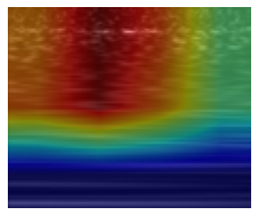
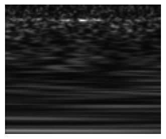

# Gravity Spy Glitch Classification and XAI

Are the neural networks that detect glitches in the Gravity Spy Project XAI certified? Do they think like physicists? Are they cheating?

This repository explores those questions by training image classifiers on Gravity Spy glitch spectrograms and then inspecting what the models attend to with saliency and class activation maps. The goal is not only to get a good classification score, but to ask whether the learned features look physically meaningful.

Two questions guide the project:

1. Can a CNN learn to classify Gravity Spy glitches accurately?
2. When it is correct, does the model base its prediction on the same structures a physicist would notice?

The answer is visualized with side-by-side explanations, where the prediction overlay is compared to the original glitch image.

## What This Repo Contains

The project includes two model families and a small XAI toolkit:

- A fine-tuned ResNet18 pipeline for glitch classification.
- A custom CNN inspired by the Zevin-Coughlin network.
- Custom saliency implementations for AblationCAM, GradCAM, and HiResCAM.
- Notebook workflows for preprocessing, evaluation, and saliency inspection.
- A script that exports example saliency overlays into `saliency_outputs/`.

## Why This Is Interesting

Gravity Spy is a citizen-science project built around identifying non-astrophysical artifacts in gravitational-wave data. The images in this repository are not ordinary photographs; they are time-frequency representations of glitches. That makes interpretability especially valuable.

If a model focuses on the same transient shape, ridge, or localized artifact that a physicist would use to identify a glitch class, that is a good sign. If it instead relies on background texture, borders, or other irrelevant patterns, then the model may be right for the wrong reason. This repo is set up to make that distinction visible.

## Models

### ResNet18

The ResNet18 pipeline uses a two-stage training strategy:

- First, the feature extractor is frozen and only the classifier head is trained.
- Then the last convolutional block is unfrozen for fine-tuning.

This gives a strong baseline while keeping training practical for a modest dataset.

Relevant files:

- [resnet_18/graspy_resnet18.py](resnet_18/graspy_resnet18.py)
- [resnet_18/train_graspy_resnet18.py](resnet_18/train_graspy_resnet18.py)
- [resnet_18/data_preprocessing.py](resnet_18/data_preprocessing.py)

### Zevin-Coughlin Net

The repository also includes a smaller custom CNN that can be trained end to end. It provides a useful contrast with the ResNet18 baseline and is a good sanity check for whether interpretability patterns are architecture-dependent.

The architecture was adapted from the paper below, which is also cited in the References section.

Relevant files:

- [zevin_coughlin_net/zevin_coughlin_net.py](zevin_coughlin_net/zevin_coughlin_net.py)
- [zevin_coughlin_net/train_zevin_coughlin_net.py](zevin_coughlin_net/train_zevin_coughlin_net.py)
- [zevin_coughlin_net/data_preprocessing.py](zevin_coughlin_net/data_preprocessing.py)

## XAI / Saliency Methods

The repository includes custom implementations of several CAM-style explainability methods:

- AblationCAM
- GradCAM
- HiResCAM

These are used to generate heatmaps that highlight which regions most influenced the model’s prediction. The main example workflow loads a trained ResNet18 checkpoint, runs a saliency method on representative samples, and saves the resulting overlays.

Relevant files:

- [heatmap_algos/AblationCAM.py](heatmap_algos/AblationCAM.py)
- [heatmap_algos/GradCAM.py](heatmap_algos/GradCAM.py)
- [heatmap_algos/HiResCAM.py](heatmap_algos/HiResCAM.py)
- [save_saliency_examples.py](save_saliency_examples.py)

## Notebooks

The notebooks provide a more exploratory path through the project:

- [data_preprocessing.ipynb](data_preprocessing.ipynb) prepares the image folders and data loaders.
- [evaluation.ipynb](evaluation.ipynb) evaluates saved models with metrics, confusion matrices, and classification reports.
- [saliency.ipynb](saliency.ipynb) demonstrates how to generate and inspect a saliency overlay interactively.

## Typical Workflow

The intended workflow is:

1. Prepare the dataset in the expected folder layout.
2. Train one or both classifiers.
3. Evaluate the saved checkpoint on held-out data.
4. Generate saliency examples to inspect model behavior.

The repository is organized so that you can either run the notebooks interactively or use the Python scripts directly.

## Outputs

The `saliency_outputs/` directory contains example figures produced by the saliency pipeline. These images are useful for comparing the raw glitch image against the regions emphasized by the model.

## Notes on Interpretation

This project does not claim that the models are XAI certified. Instead, it uses saliency maps as an investigation tool. A convincing explanation should be consistent across methods, stable under small perturbations, and aligned with domain intuition. If a heatmap looks plausible, that is evidence worth discussing. If it looks noisy or inconsistent, that is also a result.

## References

The Zevin-Coughlin network in this repository is based on:

Zevin, M., Coughlin, S., Bahaadini, S., Besler, E., Rohani, N., Allen, S., Cabero, M., Crowston, K., Katsaggelos, A. K., Lee, T. K., Littenberg, T. B., Lundgren, A., Mahabal, A., Mittal, S., Mukherjee, S., Sachdev, S., Salafia, O., Siddiqi, M., & George, D. (2017). Gravity Spy: Integrating Advanced LIGO detector characterization, machine learning, and citizen science. Classical and Quantum Gravity, 34(6), 064003. https://doi.org/10.1088/1361-6382/aa5cea

## Repository Layout

- `heatmap_algos/` custom CAM implementations.
- `resnet_18/` ResNet18 preprocessing, model, and training code.
- `zevin_coughlin_net/` smaller custom CNN and its training pipeline.
- `saliency_outputs/` saved explanation figures.
- `*.ipynb` notebooks for preprocessing, evaluation, and saliency exploration.
- `save_saliency_examples.py` batch script for exporting saliency examples.
- `tmp_eval.py` quick evaluation helper for the ResNet18 checkpoint.

## Getting Started

The code assumes a Python environment with deep learning and plotting libraries installed, plus access to the Gravity Spy image dataset in the expected local paths used by the scripts and notebooks.

If you want to reproduce the results, the fastest path is usually:

1. Open [data_preprocessing.ipynb](data_preprocessing.ipynb) and confirm the dataset path.
2. Train the desired model with the corresponding script.
3. Run [evaluation.ipynb](evaluation.ipynb) or `tmp_eval.py` to check the saved checkpoint.
4. Run `save_saliency_examples.py` or [saliency.ipynb](saliency.ipynb) to generate explanations.

## Preview

The figures below show the basic idea behind the project: compare what the model predicts with where it appears to be looking.

